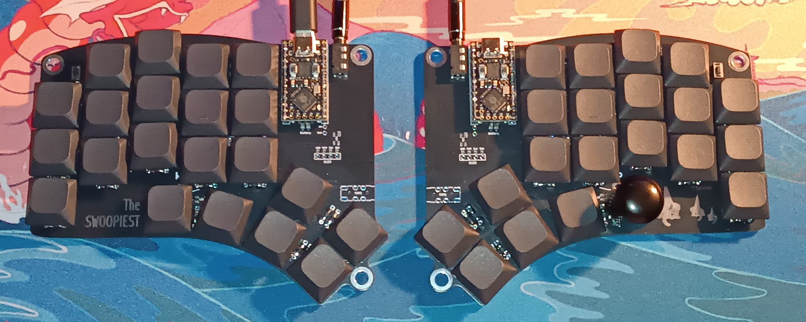
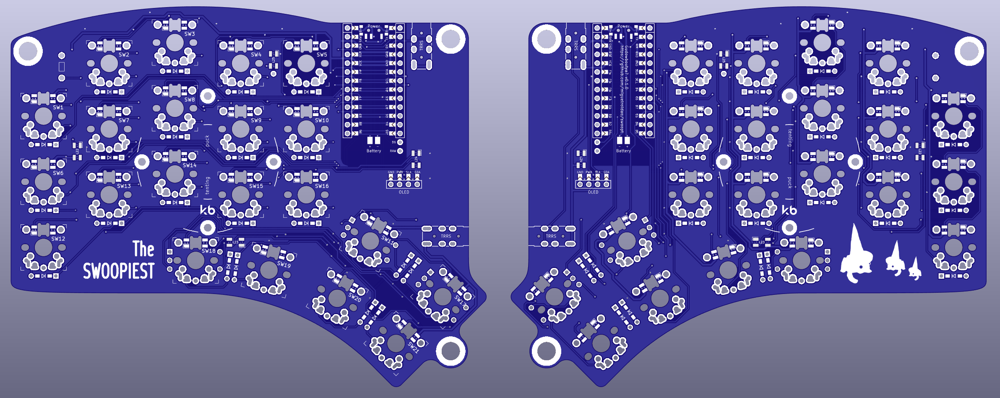

# The Swoopiest

A keyboard based on the iconic [Swoop]() and the adored [Kyria]().

## Gudhowboutya?

## Features
* Soldered universal switch footprint (not hot-swappable)
* Reversible PCB
* Per-key RGB LEDs (mini-e)
* RGB LED underglow
* Up to 2 encoders
* Oled screens
* Power switch for battery management
* Bluetooth support w/ nice!nano or nrf52840
* Tenting puck compatible
* M5 screw holes for cheap tenting

## Components list

To build and use *The Swoopiest* you will need:

* 2× Reversible PCBs
* 2× ProMicro compatible boards or 2 nice!nanos (for headers, the [nrf52840 repo](https://github.com/joric/nrfmicro/wiki/Sockets#machine-pins) has great info)
* 40-42× Keyboard switches
* 40-42× Keycaps 1u
* 40-42× SK6812 Mini-E RGB SMD Leds (optional; not recommended for wireless)
* 40-42× SK6812 3535 RGB SMD Leds (optional; not recommended for wireless)
* 42× diodes (Surface-mount or Through-hole)
* 0-2× Rotary encoders & knobs (optional; ALPS EC11)
* 0-2× OLED LCD Display 128x64 SSD1306 (optional)
* 2× reset switches (optional; (3x6x4.3mm))
* Some little rubber feet/bumpers
* 2× power switches (wireless only; MSK 12C02)
* 2× lipo batteries (wireless only)
* 1× TRRS (See below for more) cable (wired only)
* 2× TRRS Jack [PJ-320A] (wired only)
* 1× USB Cable (depends on your micro-controller choice)  

## Switch compatibility

The universal foot print makes switch incompatibility a thing of the past. The Swoopiest is compatible with most common switch types:
* Choc v1
* Choc v2
* Gateron KS33
* Cherry MX (altough with a bit too much wiggle room. The 5-pin variation fits more snuggly)

With a bit of effort, Reddragon's low profiles also fit by twisting the legs a little bit.

#### The middle pin

The middle pin of the PCB isn't connected to anything (to allow the reversible pcb in conjunction with the universal footprint).
If switches that use the middle pin are chosen (like chocs or reddragons), connect the middle pin to the pads opposite ot the other used pin.
Whether by use of a tiny piece of wire, or with a solder blob.

## Firmware

The firmware is available in my QMK repo as `diaffractus/swoopiest`.  
You can get started by using QMK's [online configurator](https://config.qmk.fm/#/bluebell/swoop/LAYOUT_split_3x5_3). Or check [The Swoopiest README file](https://github.com/MiguelRoldao/qmk-home/blob/master/keyboards/diaffractus/swoopiest/readme.md) to see how to compile the firmware locally.
